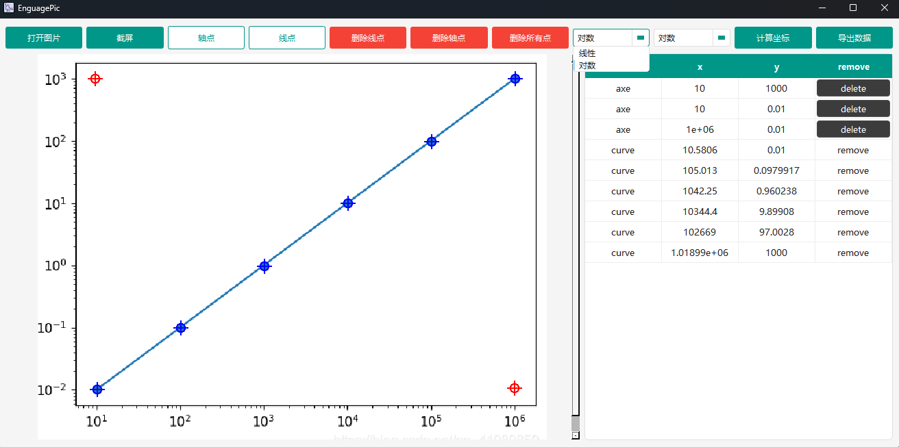
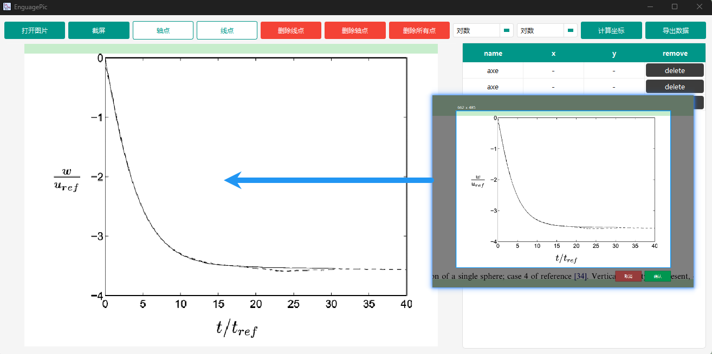

# ENGAGUA PIC

论文图片数据提取工具，快速帮助科研人员、学生提取论文中的图片数据[含坐标轴]。

## 使用方法

1. `打开图片`或者`截屏`输入数据图像
2. 点击`轴点`，添加3个坐标轴点
3. 点击`线点`，沿着数据曲线选点
4. 点击`计算坐标`开始计算线点的相对坐标
5. 点击`导出数据`导出计算坐标到csv文件中

> 支持的图片导入格式为png，jpg
> 
> 如果想要重新设置某些点，可以点击`删除*点`的按钮

## 功能说明

坐标轴类型选择

屏幕截取导入

